# TP Blockchain

### Ouvrire Git Bash 
- Pour commencer, ouvrez Git Bash.

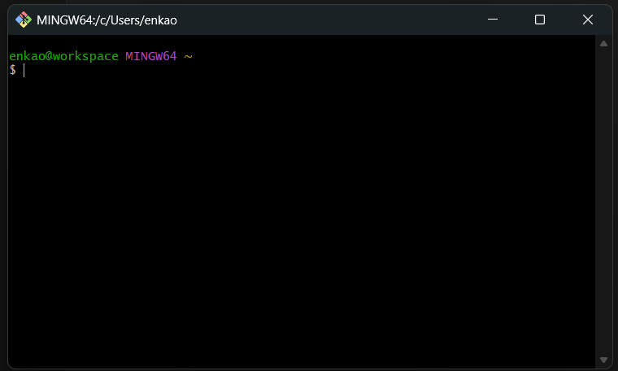


### Installer foundry : 
- Exécutez la commande suivante pour installer Foundry :

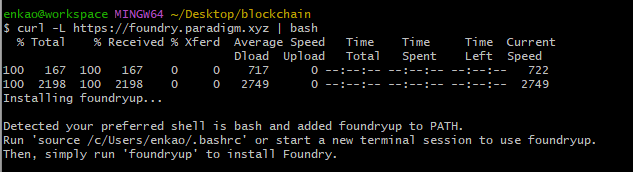

```bash
enkao@workspace MINGW64 ~/Desktop/blockchain
$ curl -L https://foundry.paradigm.xyz | bash
  % Total    % Received % Xferd  Average Speed   Time    Time     Time  Current
                                 Dload  Upload   Total   Spent    Left  Speed
100   167  100   167    0     0    717      0 --:--:-- --:--:-- --:--:--   722
100  2198  100  2198    0     0   2749      0 --:--:-- --:--:-- --:--:--  2749
Installing foundryup...

Detected your preferred shell is bash and added foundryup to PATH.
Run 'source /c/Users/enkao/.bashrc' or start a new terminal session to use foundryup.
Then, simply run 'foundryup' to install Foundry.

```

### Recharger la configuration et finaliser l'installation :
- Exécutez les commandes suivantes pour recharger la configuration et finaliser l'installation :

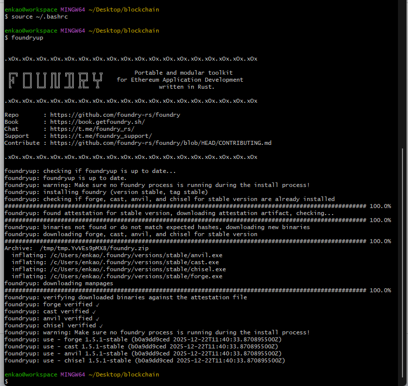

- Exécutez les commandes suivantes pour recharger la configuration et finaliser l'installation :

```bash
enkao@workspace MINGW64 ~/Desktop/blockchain
$ source ~/.bashrc

enkao@workspace MINGW64 ~/Desktop/blockchain
$ foundryup


.xOx.xOx.xOx.xOx.xOx.xOx.xOx.xOx.xOx.xOx.xOx.xOx.xOx.xOx.xOx.xOx.xOx.xOx

 ╔═╗ ╔═╗ ╦ ╦ ╔╗╔ ╔╦╗ ╦═╗ ╦ ╦         Portable and modular toolkit
 ╠╣  ║ ║ ║ ║ ║║║  ║║ ╠╦╝ ╚╦╝    for Ethereum Application Development
 ╚   ╚═╝ ╚═╝ ╝╚╝ ═╩╝ ╩╚═  ╩                 written in Rust.

.xOx.xOx.xOx.xOx.xOx.xOx.xOx.xOx.xOx.xOx.xOx.xOx.xOx.xOx.xOx.xOx.xOx.xOx

Repo       : https://github.com/foundry-rs/foundry
Book       : https://book.getfoundry.sh/
Chat       : https://t.me/foundry_rs/
Support    : https://t.me/foundry_support/
Contribute : https://github.com/foundry-rs/foundry/blob/HEAD/CONTRIBUTING.md

.xOx.xOx.xOx.xOx.xOx.xOx.xOx.xOx.xOx.xOx.xOx.xOx.xOx.xOx.xOx.xOx.xOx.xOx

foundryup: checking if foundryup is up to date...
foundryup: foundryup is up to date.
foundryup: warning: Make sure no foundry process is running during the install process!
foundryup: installing foundry (version stable, tag stable)
foundryup: checking if forge, cast, anvil, and chisel for stable version are already installed
####################################################################################################### 100.0%
foundryup: found attestation for stable version, downloading attestation artifact, checking...
####################################################################################################### 100.0%
foundryup: binaries not found or do not match expected hashes, downloading new binaries
foundryup: downloading forge, cast, anvil, and chisel for stable version
####################################################################################################### 100.0%
Archive:  /tmp/tmp.YvVEs9pMX8/foundry.zip
  inflating: /c/Users/enkao/.foundry/versions/stable/anvil.exe
  inflating: /c/Users/enkao/.foundry/versions/stable/cast.exe
  inflating: /c/Users/enkao/.foundry/versions/stable/chisel.exe
  inflating: /c/Users/enkao/.foundry/versions/stable/forge.exe
foundryup: downloading manpages
####################################################################################################### 100.0%
foundryup: verifying downloaded binaries against the attestation file
foundryup: forge verified ✓
foundryup: cast verified ✓
foundryup: anvil verified ✓
foundryup: chisel verified ✓
foundryup: warning: Make sure no foundry process is running during the install process!
foundryup: use - forge 1.5.1-stable (b0a9dd9ced 2025-12-22T11:40:33.870895500Z)
foundryup: use - cast 1.5.1-stable (b0a9dd9ced 2025-12-22T11:40:33.870895500Z)
foundryup: use - anvil 1.5.1-stable (b0a9dd9ced 2025-12-22T11:40:33.870895500Z)
foundryup: use - chisel 1.5.1-stable (b0a9dd9ced 2025-12-22T11:40:33.870895500Z)

```

### Verifier que tout fonctionne : 
- Exécutez la commande suivante pour vérifier que tout fonctionne correctement : `forge --version`

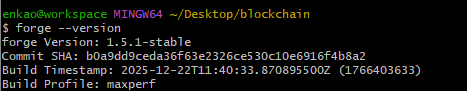


```bash
enkao@workspace MINGW64 ~/Desktop/blockchain
$ forge --version
forge Version: 1.5.1-stable
Commit SHA: b0a9dd9ceda36f63e2326ce530c10e6916f4b8a2
Build Timestamp: 2025-12-22T11:40:33.870895500Z (1766403633)
Build Profile: maxperf

```

### Initialisation du projet : 
- Exécutez la commande suivante pour initialiser un nouveau projet : `forge init my-counter-project`

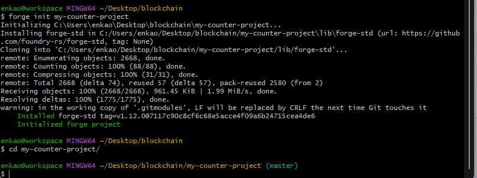


```bash
enkao@workspace MINGW64 ~/Desktop/blockchain
$ forge init my-counter-project
Initializing C:\Users\enkao\Desktop\blockchain\my-counter-project...
Installing forge-std in C:/Users/enkao/Desktop/blockchain/my-counter-project\lib\forge-std (url: https://github.com/foundry-rs/forge-std, tag: None)
Cloning into 'C:/Users/enkao/Desktop/blockchain/my-counter-project/lib/forge-std'...
remote: Enumerating objects: 2668, done.
remote: Counting objects: 100% (88/88), done.
remote: Compressing objects: 100% (31/31), done.
remote: Total 2668 (delta 74), reused 57 (delta 57), pack-reused 2580 (from 2)
Receiving objects: 100% (2668/2668), 961.45 KiB | 1.99 MiB/s, done.
Resolving deltas: 100% (1775/1775), done.
warning: in the working copy of '.gitmodules', LF will be replaced by CRLF the next time Git touches it
    Installed forge-std tag=v1.12.0@7117c90c8cf6c68e5acce4f09a6b24715cea4de6
    Initialized forge project

enkao@workspace MINGW64 ~/Desktop/blockchain
$ cd my-counter-project/

```

### Voici l'arborescence générée :

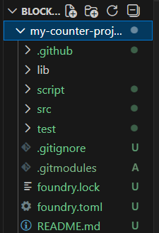

```bash
enkao@workspace MINGW64 ~/Desktop/blockchain/my-counter-project (master)
$ ls
README.md  foundry.lock  foundry.toml  lib/  script/  src/  test/

enkao@workspace MINGW64 ~/Desktop/blockchain/my-counter-project (master)
$ ls lib/
forge-std/

enkao@workspace MINGW64 ~/Desktop/blockchain/my-counter-project (master)
$ ls lib/forge-std/
CONTRIBUTING.md  LICENSE-MIT  RELEASE_CHECKLIST.md  package.json  src/
LICENSE-APACHE   README.md    foundry.toml          scripts/      test/

enkao@workspace MINGW64 ~/Desktop/blockchain/my-counter-project (master)
$ ls script/
Counter.s.sol

enkao@workspace MINGW64 ~/Desktop/blockchain/my-counter-project (master)
$ ls src
Counter.sol

enkao@workspace MINGW64 ~/Desktop/blockchain/my-counter-project (master)
$ ls test
Counter.t.sol

enkao@workspace MINGW64 ~/Desktop/blockchain/my-counter-project (master)
$ cat script/Counter.s.sol
// SPDX-License-Identifier: UNLICENSED
pragma solidity ^0.8.13;

import {Script} from "forge-std/Script.sol";
import {Counter} from "../src/Counter.sol";

contract CounterScript is Script {
    Counter public counter;

    function setUp() public {}

    function run() public {
        vm.startBroadcast();

        counter = new Counter();

        vm.stopBroadcast();
    }
}

enkao@workspace MINGW64 ~/Desktop/blockchain/my-counter-project (master)
$ cat src/Counter.sol
// SPDX-License-Identifier: UNLICENSED
pragma solidity ^0.8.13;

contract Counter {
    uint256 public number;

    function setNumber(uint256 newNumber) public {
        number = newNumber;
    }

    function increment() public {
        number++;
    }
}

enkao@workspace MINGW64 ~/Desktop/blockchain/my-counter-project (master)
$ cat test/Counter.t.sol
// SPDX-License-Identifier: UNLICENSED
pragma solidity ^0.8.13;

import {Test} from "forge-std/Test.sol";
import {Counter} from "../src/Counter.sol";

contract CounterTest is Test {
    Counter public counter;

    function setUp() public {
        counter = new Counter();
        counter.setNumber(0);
    }

    function test_Increment() public {
        counter.increment();
        assertEq(counter.number(), 1);
    }

    function testFuzz_SetNumber(uint256 x) public {
        counter.setNumber(x);
        assertEq(counter.number(), x);
    }
}

enkao@workspace MINGW64 ~/Desktop/blockchain/my-counter-project (master)
$ cat foundry.lock
{
  "lib\\forge-std": {
    "tag": {
      "name": "v1.12.0",
      "rev": "7117c90c8cf6c68e5acce4f09a6b24715cea4de6"
    }
  }
}
enkao@workspace MINGW64 ~/Desktop/blockchain/my-counter-project (master)
$ cat foundry.toml
[profile.default]
src = "src"
out = "out"
libs = ["lib"]

# See more config options https://github.com/foundry-rs/foundry/blob/master/crates/config/README.md#all-options

```

### Installer OpenZeppelin
- Exécutez la commande suivante pour installer OpenZeppelin : `forge install OpenZeppelin/openzeppelin-contracts`

```bash
enkao@workspace MINGW64 ~/Desktop/blockchain/my-counter-project (master)
$ forge install OpenZeppelin/openzeppelin-contracts
Installing openzeppelin-contracts in C:/Users/enkao/Desktop/blockchain/my-counter-project/lib\openzeppelin-contracts (url: https://github.com/OpenZeppelin/openzeppelin-contracts, tag: None)
Cloning into 'C:/Users/enkao/Desktop/blockchain/my-counter-project/lib/openzeppelin-contracts'...
remote: Enumerating objects: 54123, done.
remote: Counting objects: 100% (313/313), done.
remote: Compressing objects: 100% (239/239), done.
remote: Total 54123 (delta 181), reused 77 (delta 74), pack-reused 53810 (from 4)
Receiving objects: 100% (54123/54123), 49.03 MiB | 16.62 MiB/s, done.
Resolving deltas: 100% (34296/34296), done.
warning: in the working copy of '.gitmodules', LF will be replaced by CRLF the next time Git touches it
Submodule 'lib/erc4626-tests' (https://github.com/a16z/erc4626-tests.git) registered for path 'lib/erc4626-tests'
Submodule 'lib/forge-std' (https://github.com/foundry-rs/forge-std) registered for path 'lib/forge-std'
Submodule 'lib/halmos-cheatcodes' (https://github.com/a16z/halmos-cheatcodes) registered for path 'lib/halmos-cheatcodes'
Cloning into 'C:/Users/enkao/Desktop/blockchain/my-counter-project/lib/openzeppelin-contracts/lib/erc4626-tests'...
remote: Enumerating objects: 32, done.
remote: Counting objects: 100% (26/26), done.
remote: Compressing objects: 100% (20/20), done.
remote: Total 32 (delta 15), reused 9 (delta 4), pack-reused 6 (from 1)
Receiving objects: 100% (32/32), 29.84 KiB | 4.26 MiB/s, done.
Resolving deltas: 100% (15/15), done.
Cloning into 'C:/Users/enkao/Desktop/blockchain/my-counter-project/lib/openzeppelin-contracts/lib/forge-std'...
remote: Enumerating objects: 2668, done.
remote: Counting objects: 100% (86/86), done.
remote: Compressing objects: 100% (30/30), done.
remote: Total 2668 (delta 73), reused 56 (delta 56), pack-reused 2582 (from 2)
Receiving objects: 100% (2668/2668), 960.71 KiB | 3.97 MiB/s, done.
Resolving deltas: 100% (1777/1777), done.
Cloning into 'C:/Users/enkao/Desktop/blockchain/my-counter-project/lib/openzeppelin-contracts/lib/halmos-cheatcodes'...
remote: Enumerating objects: 47, done.
remote: Counting objects: 100% (47/47), done.
remote: Compressing objects: 100% (37/37), done.
remote: Total 47 (delta 19), reused 25 (delta 10), pack-reused 0 (from 0)
Receiving objects: 100% (47/47), 24.40 KiB | 24.40 MiB/s, done.
Resolving deltas: 100% (19/19), done.
    Installed openzeppelin-contracts tag=v5.5.0@fcbae5394ae8ad52d8e580a3477db99814b9d565
```

### Configuration de l'environnement
Créez un fichier .env dans le répertoire my-counter-project avec le contenu suivant :

```bash
RPC_URL="VOTRE_URL_SEPOLIA"
PRIVATE_KEY="VOTRE_CLE_PRIVEE_METAMASK"
etherscan_api_key="VOTRE_CLE_API_ETHERSCAN"
```
Remplacez VOTRE_URL_SEPOLIA, VOTRE_CLE_PRIVEE_METAMASK et VOTRE_CLE_API_ETHERSCAN par vos propres valeurs.

> ### RPC_URL Metamask Developer 
- https://sepolia.infura.io/v3/95**
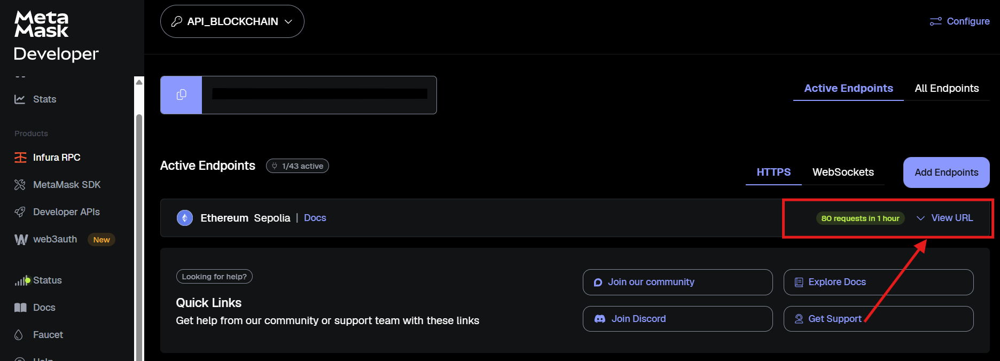

> ### etherscan_api_key Etherscan Api Key 
- etherscan_api_key=YQ**
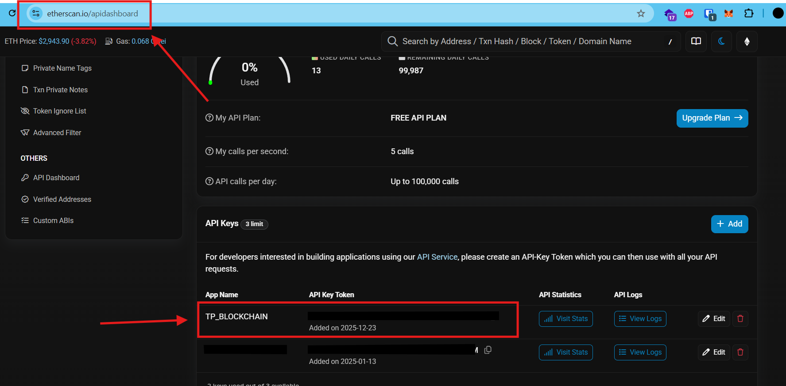


> ### PRIVATE_KEY Metamask Extention PrivateKey
- 5f**
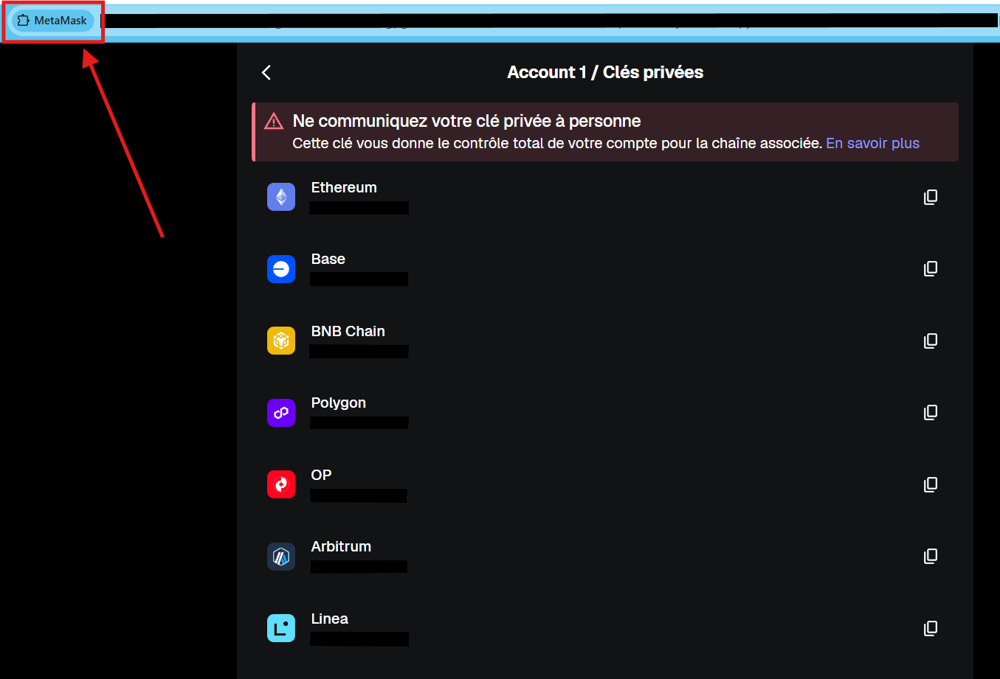


### Compilation et test local : 
#### Build : 
- Exécutez la commande suivante pour compiler le projet : `forge build`

```bash
$ forge build

[⠢] Compiling...

[⠆] Compiling 23 files with Solc 0.8.33

[⠰] Installing Solc version 0.8.33

[⠆] Successfully installed Solc 0.8.33

[⠰] Solc 0.8.33 finished in 3.79s

Compiler run successful with warnings:

Warning (2424): Natspec memory-safe-assembly special comment for inline assembly is deprecated and scheduled for removal. Use the memory-safe block annotation instead.

   --> lib/forge-std/src/StdStorage.sol:297:13:

    |

297 |             assembly {

    |             ^ (Relevant source part starts here and spans across multiple lines).


Warning (2424): Natspec memory-safe-assembly special comment for inline assembly is deprecated and scheduled for removal. Use the memory-safe block annotation instead.

   --> lib/forge-std/src/StdStorage.sol:404:9:

    |

404 |         assembly {

    |         ^ (Relevant source part starts here and spans across multiple lines).


Warning (2424): Natspec memory-safe-assembly special comment for inline assembly is deprecated and scheduled for removal. Use the memory-safe block annotation instead.

  --> lib/forge-std/src/console.sol:11:9:

   |

11 |         assembly {

   |         ^ (Relevant source part starts here and spans across multiple lines).


Warning (2424): Natspec memory-safe-assembly special comment for inline assembly is deprecated and scheduled for removal. Use the memory-safe block annotation instead.

  --> lib/forge-std/src/safeconsole.sol:15:9:

   |

15 |         assembly {

   |         ^ (Relevant source part starts here and spans across multiple lines).


Warning (2424): Natspec memory-safe-assembly special comment for inline assembly is deprecated and scheduled for removal. Use the memory-safe block annotation instead.

  --> lib/forge-std/src/safeconsole.sol:23:9:

   |

23 |         assembly {

   |         ^ (Relevant source part starts here and spans across multiple lines).


Warning (2424): Natspec memory-safe-assembly special comment for inline assembly is deprecated and scheduled for removal. Use the memory-safe block annotation instead.

  --> lib/forge-std/src/safeconsole.sol:32:9:

   |

32 |         assembly {

   |         ^ (Relevant source part starts here and spans across multiple lines).


Warning (2424): Natspec memory-safe-assembly special comment for inline assembly is deprecated and scheduled for removal. Use the memory-safe block annotation instead.

  --> lib/forge-std/src/safeconsole.sol:40:9:

   |

40 |         assembly {


...

Warning (2424): Natspec memory-safe-assembly special comment for inline assembly is deprecated and scheduled for removal. Use the memory-safe block annotation instead.

    --> lib/forge-std/src/safeconsole.sol:4314:9:

     |

4314 |         assembly {

     |         ^ (Relevant source part starts here and spans across multiple lines).


Warning (2424): Natspec memory-safe-assembly special comment for inline assembly is deprecated and scheduled for removal. Use the memory-safe block annotation instead.

    --> lib/forge-std/src/safeconsole.sol:4332:9:

     |

4332 |         assembly {

     |         ^ (Relevant source part starts here and spans across multiple lines).


Warning (2424): Natspec memory-safe-assembly special comment for inline assembly is deprecated and scheduled for removal. Use the memory-safe block annotation instead.

    --> lib/forge-std/src/safeconsole.sol:4347:9:

     |

4347 |         assembly {

     |         ^ (Relevant source part starts here and spans across multiple lines).


Warning (2424): Natspec memory-safe-assembly special comment for inline assembly is deprecated and scheduled for removal. Use the memory-safe block annotation instead.

    --> lib/forge-std/src/safeconsole.sol:4363:9:

     |

4363 |         assembly {

     |         ^ (Relevant source part starts here and spans across multiple lines).


Warning (4591): There are more than 256 warnings. Ignoring the rest.
```


#### Test : 
- Exécutez la commande suivante pour exécuter les tests : `forge test`

```bash
enkao@workspace MINGW64 ~/Desktop/blockchain/my-counter-project (master)
$ forge test
[⠊] Compiling...
No files changed, compilation skipped

Ran 2 tests for test/Counter.t.sol:CounterTest
[PASS] testFuzz_SetNumber(uint256) (runs: 256, μ: 27578, ~: 29289)
[PASS] test_Increment() (gas: 28783)
Suite result: ok. 2 passed; 0 failed; 0 skipped; finished in 3.37ms (3.14ms CPU time)

Ran 1 test suite in 9.73ms (3.37ms CPU time): 2 tests passed, 0 failed, 0 skipped (2 total tests)

```

### Deploiement sur testnet sepolia :
- Exécutez la commande suivante pour déployer le contrat sur le testnet Sepolia : `forge script script/Counter.s.sol:CounterScript --rpc-url $RPC_URL --private-key $PRIVATE_KEY --broadcast`

```bash
enkao@workspace MINGW64 ~/Desktop/blockchain/my-counter-project (master)
$ source .env

enkao@workspace MINGW64 ~/Desktop/blockchain/my-counter-project (master)
$ forge script script/Counter.s.sol:CounterScript --rpc-url $RPC_URL --private-key $PRIVATE_KEY --broadcast
[⠊] Compiling...
No files changed, compilation skipped
Script ran successfully.

## Setting up 1 EVM.

==========================

Chain 11155111

Estimated gas price: 0.133305662 gwei

Estimated total gas used for script: 203856

Estimated amount required: 0.000027175159032672 ETH

==========================

Transactions saved to: C:/Users/enkao/Desktop/blockchain/my-counter-project\broadcast\Counter.s.sol\11155111\run-latest.json

Sensitive values saved to: C:/Users/enkao/Desktop/blockchain/my-counter-project/cache\Counter.s.sol\11155111\run-latest.json

Error: Failed to send transaction after 4 attempts Err(server returned an error response: error code -32000: insufficient funds for gas * price + value: balance 0, tx cost 27175159032672, overshot 27175159032672)

```

#### Erreur dans le deploiement : 
`error code -32000: insufficient funds for gas * price + value: balance 0, tx cost 27175159032672, overshot 27175159032672)`


#### Remplir le portefeuille 
étape "Faucet" (le robinet à crypto). Il faut aller chercher de la fausse monnaie.
- Recuperer l'adresse public de metamask : 0x61aB44c329ff52125c51DC950C1CFE5A533722D8 
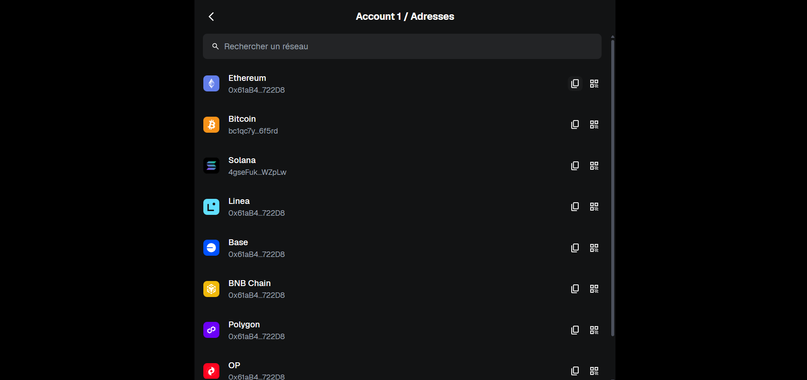

- Aller sur web3 faucet etherum sepolia : 
https://cloud.google.com/application/web3/faucet/ethereum/sepolia

Attendre que la transaction soit complete : 
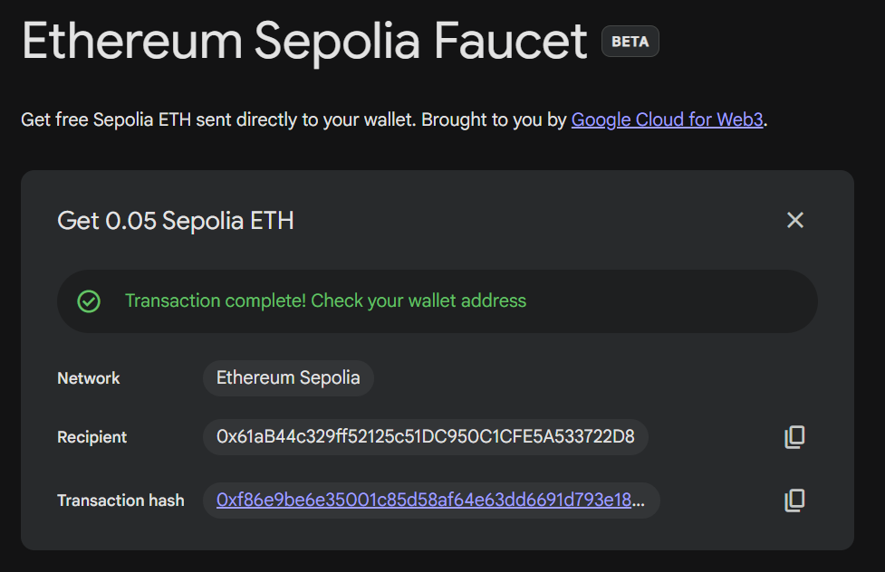
- Recommencer : `forge script script/Counter.s.sol:CounterScript --rpc-url $RPC_URL --private-key $PRIVATE_KEY --broadcast`

#### Resultat : 
```bash
enkao@workspace MINGW64 ~/Desktop/blockchain/my-counter-project (master)
$ forge script script/Counter.s.sol:CounterScript --rpc-url $RPC_URL --private-key $PRIVATE_KEY --broadcast
[⠊] Compiling...
No files changed, compilation skipped
Script ran successfully.

## Setting up 1 EVM.

==========================

Chain 11155111

Estimated gas price: 0.628533078 gwei

Estimated total gas used for script: 203856

Estimated amount required: 0.000128130239148768 ETH

==========================

##### sepolia
✅  [Success] Hash: 0x61192b6f2f0170b4785d599d0c77aa1f472999ba8035f5cbddb5da799b5f83bd
Contract Address: 0x7ea1B8913DEb7804Ec68Bf0Eb16721230f03e6C8
Block: 9899257
Paid: 0.000047388501115077 ETH (156813 gas * 0.302197529 gwei)

✅ Sequence #1 on sepolia | Total Paid: 0.000047388501115077 ETH (156813 gas * avg 0.302197529 gwei)


==========================

ONCHAIN EXECUTION COMPLETE & SUCCESSFUL.

Transactions saved to: C:/Users/enkao/Desktop/blockchain/my-counter-project/broadcast\Counter.s.sol\11155111\run-latest.json

Sensitive values saved to: C:/Users/enkao/Desktop/blockchain/my-counter-project/cache\Counter.s.sol\11155111\run-latest.json

```


### Phase 2 : Vesting Wallet (DApp de Vesting)
Objectif du contrat : Permettre à une entreprise (le propriétaire) de bloquer des jetons ERC20 pour un employé (le bénéficiaire) et de les libérer progressivement.

#### Création du fichier : 
`touch src/VestingWallet.sol``

#### Ajouter dans le fichier cela : 
```js
// SPDX-License-Identifier: MIT
pragma solidity ^0.8.20;

import "@openzeppelin/contracts/token/ERC20/IERC20.sol";
import "@openzeppelin/contracts/access/Ownable.sol";
import "@openzeppelin/contracts/utils/ReentrancyGuard.sol";

contract VestingWallet is Ownable, ReentrancyGuard {
    
    // Structure pour stocker les infos d'un calendrier de vesting
    struct VestingSchedule {
        address beneficiary;    // L'employé
        uint256 cliff;          // Date de début du déblocage (timestamp)
        uint256 duration;       // Durée totale du vesting (en secondes)
        uint256 totalAmount;    // Montant total alloué
        uint256 releasedAmount; // Montant déjà retiré
    }

    // Le jeton que l'on va distribuer (immuable une fois défini)
    IERC20 public immutable token;

    // Mapping pour lier une adresse à son calendrier
    mapping(address => VestingSchedule) public vestingSchedules;

    // Constructeur : Initialise le propriétaire et l'adresse du jeton
    constructor(address tokenAddress) Ownable(msg.sender) {
        require(tokenAddress != address(0), "Token address cannot be zero");
        token = IERC20(tokenAddress);
    }

    // ... Les fonctions viendront ici ...
}
```

#### Build : 
```bash
enkao@workspace MINGW64 ~/Desktop/blockchain/my-counter-project (master)
$ touch src/VestingWallet.sol

enkao@workspace MINGW64 ~/Desktop/blockchain/my-counter-project (master)
$ forge build
[⠊] Compiling...
[⠢] Compiling 6 files with Solc 0.8.33
[⠆] Solc 0.8.33 finished in 44.61ms
Compiler run successful!
note[unaliased-plain-import]: use named imports '{A, B}' or alias 'import ".." as X'
 --> src\VestingWallet.sol:4:8
  |
4 | import "@openzeppelin/contracts/token/ERC20/IERC20.sol";
  |        ^^^^^^^^^^^^^^^^^^^^^^^^^^^^^^^^^^^^^^^^^^^^^^^^
  |
  = help: https://book.getfoundry.sh/reference/forge/forge-lint#unaliased-plain-import

note[unaliased-plain-import]: use named imports '{A, B}' or alias 'import ".." as X'
 --> src\VestingWallet.sol:5:8
  |
5 | import "@openzeppelin/contracts/access/Ownable.sol";
  |        ^^^^^^^^^^^^^^^^^^^^^^^^^^^^^^^^^^^^^^^^^^^^
  |
  = help: https://book.getfoundry.sh/reference/forge/forge-lint#unaliased-plain-import

note[unaliased-plain-import]: use named imports '{A, B}' or alias 'import ".." as X'
 --> src\VestingWallet.sol:6:8
  |
6 | import "@openzeppelin/contracts/utils/ReentrancyGuard.sol";
  |        ^^^^^^^^^^^^^^^^^^^^^^^^^^^^^^^^^^^^^^^^^^^^^^^^^^^
  |
  = help: https://book.getfoundry.sh/reference/forge/forge-lint#unaliased-plain-import

note[screaming-snake-case-immutable]: immutables should use SCREAMING_SNAKE_CASE
  --> src\VestingWallet.sol:20:29
   |
20 |     IERC20 public immutable token;
   |                             ^^^^^ help: consider using: `TOKEN`
   |
   = help: https://book.getfoundry.sh/reference/forge/forge-lint#screaming-snake-case-immutable

```

ça fonctionne ont va maintenant ajouter les fonctions : 

#### AJouter les fonction et rebuild : 

```js
// SPDX-License-Identifier: MIT
pragma solidity ^0.8.20;

import "@openzeppelin/contracts/token/ERC20/IERC20.sol";
import "@openzeppelin/contracts/access/Ownable.sol";
import "@openzeppelin/contracts/utils/ReentrancyGuard.sol";

contract VestingWallet is Ownable, ReentrancyGuard {
    
    // Structure pour stocker les infos d'un calendrier de vesting
    struct VestingSchedule {
        address beneficiary;    // L'employé
        uint256 cliff;          // Date de début du déblocage (timestamp)
        uint256 duration;       // Durée totale du vesting (en secondes)
        uint256 totalAmount;    // Montant total alloué
        uint256 releasedAmount; // Montant déjà retiré
    }

    // Le jeton que l'on va distribuer (immuable une fois défini)
    IERC20 public immutable token;

    // Mapping pour lier une adresse à son calendrier
    mapping(address => VestingSchedule) public vestingSchedules;

    // Constructeur : Initialise le propriétaire et l'adresse du jeton
    constructor(address tokenAddress) Ownable(msg.sender) {
        require(tokenAddress != address(0), "Token address cannot be zero");
        token = IERC20(tokenAddress);
    }

    /**
     * @notice Crée un nouveau calendrier de vesting pour un bénéficiaire.
     * @dev L'owner doit avoir approuvé (approve) le contrat pour dépenser ses tokens avant d'appeler cette fonction !
     */
    function createVestingSchedule(
        address _beneficiary,
        uint256 _totalAmount,
        uint256 _cliff,
        uint256 _duration
    ) external onlyOwner {
        // 1. Vérifications de sécurité (Checks)
        require(_beneficiary != address(0), "Beneficiary cannot be zero address");
        require(_totalAmount > 0, "Amount must be > 0");
        require(_duration > 0, "Duration must be > 0");
        // On s'assure qu'un vesting n'existe pas déjà pour cette personne
        require(vestingSchedules[_beneficiary].totalAmount == 0, "Schedule already exists");

        // 2. Transfert des fonds vers le contrat (Interactions)
        // Le contrat récupère les tokens du propriétaire pour les sécuriser
        bool success = token.transferFrom(msg.sender, address(this), _totalAmount);
        require(success, "Token transfer failed");

        // 3. Enregistrement du calendrier (Effects)
        vestingSchedules[_beneficiary] = VestingSchedule({
            beneficiary: _beneficiary,
            cliff: _cliff,
            duration: _duration,
            totalAmount: _totalAmount,
            releasedAmount: 0
        });
    }
}
```

#### Rebuild : 
```bash
enkao@workspace MINGW64 ~/Desktop/blockchain/my-counter-project (master)
$ forge build
[⠊] Compiling...
[⠒] Compiling 1 files with Solc 0.8.33
[⠢] Solc 0.8.33 finished in 47.94ms
Compiler run successful!
note[unaliased-plain-import]: use named imports '{A, B}' or alias 'import ".." as X'
 --> src\VestingWallet.sol:4:8
  |
4 | import "@openzeppelin/contracts/token/ERC20/IERC20.sol";
  |        ^^^^^^^^^^^^^^^^^^^^^^^^^^^^^^^^^^^^^^^^^^^^^^^^
  |
  = help: https://book.getfoundry.sh/reference/forge/forge-lint#unaliased-plain-import

note[unaliased-plain-import]: use named imports '{A, B}' or alias 'import ".." as X'
 --> src\VestingWallet.sol:5:8
  |
5 | import "@openzeppelin/contracts/access/Ownable.sol";
  |        ^^^^^^^^^^^^^^^^^^^^^^^^^^^^^^^^^^^^^^^^^^^^
  |
  = help: https://book.getfoundry.sh/reference/forge/forge-lint#unaliased-plain-import

note[unaliased-plain-import]: use named imports '{A, B}' or alias 'import ".." as X'
 --> src\VestingWallet.sol:6:8
  |
6 | import "@openzeppelin/contracts/utils/ReentrancyGuard.sol";
  |        ^^^^^^^^^^^^^^^^^^^^^^^^^^^^^^^^^^^^^^^^^^^^^^^^^^^
  |
  = help: https://book.getfoundry.sh/reference/forge/forge-lint#unaliased-plain-import

note[screaming-snake-case-immutable]: immutables should use SCREAMING_SNAKE_CASE
  --> src\VestingWallet.sol:20:29
   |
20 |     IERC20 public immutable token;
   |                             ^^^^^ help: consider using: `TOKEN`
   |
   = help: https://book.getfoundry.sh/reference/forge/forge-lint#screaming-snake-case-immutable
```


### Calculer et retirer les jetons : 
#### Ajouter ces fonctions apres `creatVestingSchedule`:

```js
/**
     * @notice Calcule le montant total de jetons libérés (vested) à l'instant présent.
     * @dev La libération est linéaire après le cliff.
     */
    function getVestedAmount(address _beneficiary) public view returns (uint256) {
        VestingSchedule memory schedule = vestingSchedules[_beneficiary];

        // S'il n'y a pas de calendrier, rien n'est dû
        if (schedule.totalAmount == 0) {
            return 0;
        }

        // Si on est avant la date de début (cliff), rien n'est débloqué
        if (block.timestamp < schedule.cliff) {
            return 0;
        }

        // Si la période de vesting est terminée, tout est débloqué
        if (block.timestamp >= schedule.cliff + schedule.duration) {
            return schedule.totalAmount;
        }

        // Sinon, calcul linéaire : (MontantTotal * TempsEcoulé) / DuréeTotale
        uint256 timeSinceCliff = block.timestamp - schedule.cliff;
        return (schedule.totalAmount * timeSinceCliff) / schedule.duration;
    }

    /**
     * @notice Permet au bénéficiaire de réclamer ses jetons débloqués.
     * @dev Utilise nonReentrant pour la sécurité.
     */
    function claimVestedTokens() external nonReentrant {
        // On récupère le calendrier de celui qui appelle la fonction (msg.sender)
        VestingSchedule storage schedule = vestingSchedules[msg.sender];
        require(schedule.totalAmount > 0, "No vesting schedule found for sender");

        // Combien de tokens sont "mérités" au total à cet instant ?
        uint256 vestedAmount = getVestedAmount(msg.sender);
        
        // Combien peut-il retirer maintenant ? (Total mérité - Déjà retiré)
        uint256 claimable = vestedAmount - schedule.releasedAmount;
        require(claimable > 0, "Nothing to claim yet");

        // EFFECTS : On met à jour l'état AVANT le transfert (Protection anti-reentrance)
        schedule.releasedAmount += claimable;

        // INTERACTIONS : On envoie les jetons
        bool success = token.transfer(msg.sender, claimable);
        require(success, "Token transfer failed");
    }
```

puis rebuild : 

```bash
enkao@workspace MINGW64 ~/Desktop/blockchain/my-counter-project (master)
$ forge build
[⠊] Compiling...
[⠒] Compiling 1 files with Solc 0.8.33
[⠢] Solc 0.8.33 finished in 51.30ms
Compiler run successful!
note[unaliased-plain-import]: use named imports '{A, B}' or alias 'import ".." as X'
 --> src\VestingWallet.sol:4:8
  |
4 | import "@openzeppelin/contracts/token/ERC20/IERC20.sol";
  |        ^^^^^^^^^^^^^^^^^^^^^^^^^^^^^^^^^^^^^^^^^^^^^^^^
  |
  = help: https://book.getfoundry.sh/reference/forge/forge-lint#unaliased-plain-import

note[unaliased-plain-import]: use named imports '{A, B}' or alias 'import ".." as X'
 --> src\VestingWallet.sol:5:8
  |
5 | import "@openzeppelin/contracts/access/Ownable.sol";
  |        ^^^^^^^^^^^^^^^^^^^^^^^^^^^^^^^^^^^^^^^^^^^^
  |
  = help: https://book.getfoundry.sh/reference/forge/forge-lint#unaliased-plain-import

note[unaliased-plain-import]: use named imports '{A, B}' or alias 'import ".." as X'
 --> src\VestingWallet.sol:6:8
  |
6 | import "@openzeppelin/contracts/utils/ReentrancyGuard.sol";
  |        ^^^^^^^^^^^^^^^^^^^^^^^^^^^^^^^^^^^^^^^^^^^^^^^^^^^
  |
  = help: https://book.getfoundry.sh/reference/forge/forge-lint#unaliased-plain-import

note[screaming-snake-case-immutable]: immutables should use SCREAMING_SNAKE_CASE
  --> src\VestingWallet.sol:20:29
   |
20 |     IERC20 public immutable token;
   |                             ^^^^^ help: consider using: `TOKEN`
   |
   = help: https://book.getfoundry.sh/reference/forge/forge-lint#screaming-snake-case-immutable
```

#### Verification : 
nous ne pouvons pas déployer cela "à l'aveugle". Nous devons vérifier que les maths fonctionnent, surtout la gestion du temps (le "Cliff").

Pour cela, nous allons utiliser la puissance de Foundry : le Time Travel (voyage dans le temps).

Étape 4 : Création du Test (Le Simulateur)
Nous allons créer un scénario complet :

- On déploie un faux jeton (MockERC20).
- On crée un vesting pour un employé.
- On vérifie qu'il ne peut rien retirer au début.
- On avance le temps de 6 mois (avec vm.warp).
- On vérifie qu'il peut retirer la moitié.

#### 1. On créer `test/VestingWallet.t.sol`

```js
// SPDX-License-Identifier: MIT
pragma solidity ^0.8.20;

import "forge-std/Test.sol";
import "../src/VestingWallet.sol";
import "@openzeppelin/contracts/token/ERC20/ERC20.sol";

// 1. Création d'un Faux Jeton pour le test (Mock)
contract MockERC20 is ERC20 {
    constructor() ERC20("Mock Token", "MCK") {
        _mint(msg.sender, 1000000 * 10**18); // On se donne 1 million de tokens au début
    }
}

contract VestingWalletTest is Test {
    VestingWallet public vestingWallet;
    MockERC20 public token;

    address public owner;
    address public beneficiary;

    function setUp() public {
        // Configuration initiale
        owner = address(this);           // Le test est le "patron"
        beneficiary = address(0x123);    // Un employé fictif
        
        // Déploiement du faux jeton et du wallet
        token = new MockERC20();
        vestingWallet = new VestingWallet(address(token));

        // IMPORTANT: L'owner doit approuver le vesting wallet pour qu'il puisse prendre les sous
        token.approve(address(vestingWallet), type(uint256).max);
    }

    function test_FullVestingScenario() public {
        uint256 totalAmount = 1000 * 10**18; // 1000 tokens
        uint256 duration = 1000 seconds;     // Durée de 1000 secondes pour simplifier les maths
        uint256 cliff = block.timestamp;     // Le cliff commence "maintenant"

        // 1. Création du calendrier
        vestingWallet.createVestingSchedule(beneficiary, totalAmount, cliff, duration);
        
        // Vérification : Le contrat a bien pris les tokens
        assertEq(token.balanceOf(address(vestingWallet)), totalAmount);

        // 2. Test avant le temps écoulé (devrait être 0 ou très peu)
        // On simule l'employé qui essaie de retirer tout de suite
        vm.prank(beneficiary); // Le prochain appel vient du beneficiary
        vm.expectRevert("Nothing to claim yet"); // On s'attend à ce que ça échoue
        vestingWallet.claimVestedTokens();

        // 3. VOYAGE DANS LE TEMPS : On avance de 50% de la durée (500 secondes)
        vm.warp(cliff + 500); 

        // Vérification du montant débloqué (devrait être 500 tokens)
        uint256 vested = vestingWallet.getVestedAmount(beneficiary);
        assertEq(vested, 500 * 10**18);

        // 4. Retrait des fonds
        vm.prank(beneficiary); // L'employé appelle
        vestingWallet.claimVestedTokens();

        // Vérification finale : L'employé a bien reçu ses 500 tokens
        assertEq(token.balanceOf(beneficiary), 500 * 10**18);
    }
}
```

Points clés du test:

- MockERC20 : Un jeton jetable juste pour tester.
- vm.warp(timestamp) : La commande magique de Foundry qui change l'heure de la blockchain.
- vm.prank(address) : Permet d'imiter quelqu'un d'autre (ici, l'employé) pour le prochain appel de fonction.

#### On lance le test : 
forge test

```bash
enkao@workspace MINGW64 ~/Desktop/blockchain/my-counter-project (master)

$ forge test

[⠊] Compiling...

[⠘] Compiling 4 files with Solc 0.8.33

[⠃] Solc 0.8.33 finished in 628.48ms

Compiler run successful with warnings:

Warning (2424): Natspec memory-safe-assembly special comment for inline assembly is deprecated and scheduled for removal. Use the memory-safe block annotation instead.

   --> lib/forge-std/src/StdStorage.sol:297:13:

    |

297 |             assembly {

    |             ^ (Relevant source part starts here and spans across multiple lines).


Warning (2424): Natspec memory-safe-assembly special comment for inline assembly is deprecated and scheduled for removal. Use the memory-safe block annotation instead.

   --> lib/forge-std/src/StdStorage.sol:404:9:

    |

404 |         assembly {

    |         ^ (Relevant source part starts here and spans across multiple lines).


Warning (2424): Natspec memory-safe-assembly special comment for inline assembly is deprecated and scheduled for removal. Use the memory-safe block annotation instead.

   --> lib/forge-std/src/StdChains.sol:180:21:

    |

180 |                     assembly {

    |                     ^ (Relevant source part starts here and spans across multiple lines).

...

Warning (2424): Natspec memory-safe-assembly special comment for inline assembly is deprecated and scheduled for removal. Use the memory-safe block annotation instead.

    --> lib/forge-std/src/safeconsole.sol:4240:9:

     |

4240 |         assembly {

     |         ^ (Relevant source part starts here and spans across multiple lines).


Warning (2424): Natspec memory-safe-assembly special comment for inline assembly is deprecated and scheduled for removal. Use the memory-safe block annotation instead.

    --> lib/forge-std/src/safeconsole.sol:4256:9:

     |

4256 |         assembly {

     |         ^ (Relevant source part starts here and spans across multiple lines).


Warning (4591): There are more than 256 warnings. Ignoring the rest.


Ran 1 test for test/VestingWallet.t.sol:VestingWalletTest

[PASS] test_FullVestingScenario() (gas: 214411)

Suite result: ok. 1 passed; 0 failed; 0 skipped; finished in 579.00µs (192.80µs CPU time)


Ran 2 tests for test/Counter.t.sol:CounterTest

[PASS] testFuzz_SetNumber(uint256) (runs: 256, μ: 28045, ~: 29289)

[PASS] test_Increment() (gas: 28783)

Suite result: ok. 2 passed; 0 failed; 0 skipped; finished in 3.16ms (3.02ms CPU time)


Ran 2 test suites in 10.22ms (3.74ms CPU time): 3 tests passed, 0 failed, 0 skipped (3 total tests)


```

Le message [PASS] test_FullVestingScenario() confirme que toute la logique est correcte :
- Le contrat bloque bien les fonds.
- Il empêche les retraits avant la date prévue.
- Le calcul des gains dans le temps (Time Travel) fonctionne parfaitement.

### Phase 3 : Le Déploiement Réel (Mainnet Test)

Maintenant que le code est validé, nous allons le mettre en ligne sur Sepolia.

Pour que le VestingWallet serve à quelque chose, il doit gérer un vrai jeton. Comme nous sommes sur un testnet, nous allons déployer deux contrats d'un coup :
- Un faux jeton (MockToken) pour avoir de la monnaie à distribuer.
- Le VestingWallet qui utilisera ce jeton.

1. Créer le ficheir du token: 
Nous devons sortir le MockERC20 du fichier de test pour en faire un vrai contrat déployable.

Créez le fichier src/MockToken.sol et collez ce code :

Solidity

```js
// SPDX-License-Identifier: MIT
pragma solidity ^0.8.20;

import "@openzeppelin/contracts/token/ERC20/ERC20.sol";

contract MockToken is ERC20 {
    // On crée un token "My Test Token" (MTT) et on se donne 1 million d'unités
    constructor() ERC20("My Test Token", "MTT") {
        _mint(msg.sender, 1000000 * 10**18);
    }
}
```

2. Créer le Script de Déploiement
Créez le fichier script/DeployVestingWallet.s.sol. Ce script va dire à la blockchain : 

"Déploie mon Token, récupère son adresse, et utilise-la pour déployer mon VestingWallet".

```js
// SPDX-License-Identifier: MIT
pragma solidity ^0.8.20;

import "forge-std/Script.sol";
import "../src/VestingWallet.sol";
import "../src/MockToken.sol";

contract DeployVestingWallet is Script {
    function run() external {
        // On récupère la clé privée du fichier .env
        uint256 deployerPrivateKey = vm.envUint("PRIVATE_KEY");

        // Début de la transaction (tout ce qui suit est payant en gas)
        vm.startBroadcast(deployerPrivateKey);

        // 1. Déploiement du Jeton
        MockToken token = new MockToken();
        console.log("Token deployed at:", address(token));

        // 2. Déploiement du VestingWallet (en lui donnant l'adresse du jeton)
        VestingWallet wallet = new VestingWallet(address(token));
        console.log("VestingWallet deployed at:", address(wallet));

        vm.stopBroadcast();
    }
}
```

3. Lancer le déploiement sur Sepolia
S'assurez d'avoir encore un peu de SepoliaETH (si le déploiement précédent a marché, il en reste normalement).

Lancez cette commande (c'est la même logique que pour le Counter, mais avec le nouveau script) :


`forge script script/DeployVestingWallet.s.sol:DeployVestingWallet --rpc-url $RPC_URL --broadcast --verify`

```bash
enkao@workspace MINGW64 ~/Desktop/blockchain/my-counter-project (master)
$ forge script script/DeployVestingWallet.s.sol:DeployVestingWallet --rpc-url $RPC_URL --broadcast --verify
[⠊] Compiling...
[⠑] Compiling 2 files with Solc 0.8.33
[⠘] Solc 0.8.33 finished in 579.53ms
Compiler run successful with warnings:
Warning (2424): Natspec memory-safe-assembly special comment for inline assembly is deprecated and scheduled for removal. Use the memory-safe block annotation instead.
   --> lib/forge-std/src/StdStorage.sol:297:13:
    |
297 |             assembly {
    |             ^ (Relevant source part starts here and spans across multiple lines).

Warning (2424): Natspec memory-safe-assembly special comment for inline assembly is deprecated and scheduled for removal. Use the memory-safe block annotation instead.
   --> lib/forge-std/src/StdStorage.sol:404:9:
    |
404 |         assembly {
    |         ^ (Relevant source part starts here and spans across multiple lines).

Warning (2424): Natspec memory-safe-assembly special comment for inline assembly is deprecated and scheduled for removal. Use the memory-safe block annotation instead.
  --> lib/forge-std/src/console.sol:11:9:
   |
11 |         assembly {
   |         ^ (Relevant source part starts here and spans across multiple lines).
...
Warning (2424): Natspec memory-safe-assembly special comment for inline assembly is deprecated and scheduled for removal. Use the memory-safe block annotation instead.
    --> lib/forge-std/src/safeconsole.sol:4347:9:
     |
4347 |         assembly {
     |         ^ (Relevant source part starts here and spans across multiple lines).

Warning (2424): Natspec memory-safe-assembly special comment for inline assembly is deprecated and scheduled for removal. Use the memory-safe block annotation instead.
    --> lib/forge-std/src/safeconsole.sol:4363:9:
     |
4363 |         assembly {
     |         ^ (Relevant source part starts here and spans across multiple lines).

Warning (4591): There are more than 256 warnings. Ignoring the rest.
Traces:
  [2606674] → new DeployVestingWallet@0x9f7cF1d1F558E57ef88a59ac3D47214eF25B6A06
    └─ ← [Return] 12907 bytes of code

  [3096] DeployVestingWallet::run()
    ├─ [0] VM::envUint("PRIVATE_KEY") [staticcall]
    │   └─ ← [Revert] vm.envUint: failed parsing $PRIVATE_KEY as type `uint256`: missing hex prefix ("0x") for hex string
    └─ ← [Revert] vm.envUint: failed parsing $PRIVATE_KEY as type `uint256`: missing hex prefix ("0x") for hex string


Error: script failed: vm.envUint: failed parsing $PRIVATE_KEY as type `uint256`: missing hex prefix ("0x") for hex string

```

L'erreur : missing hex prefix ("0x") La cause : Le script Solidity essaie de lire la clé privée via vm.envUint, mais MetaMask a donné la clé "brute" (ex: 5fb...), alors que le code Solidity attend un format hexadécimal complet commençant par 0x.

1. Modifier .env 
- Avant : PRIVATE_KEY="5fb................"
- Après : PRIVATE_KEY="0x5fb................"

2. Recharger les variables : 
source .env

3. Relancer le deploiement : `forge script script/DeployVestingWallet.s.sol:DeployVestingWallet --rpc-url $RPC_URL --broadcast --verify`

```bash
enkao@workspace MINGW64 ~/Desktop/blockchain/my-counter-project (master)
$ forge script script/DeployVestingWallet.s.sol:DeployVestingWallet --rpc-url $RPC_URL --broadcast --verify
[⠊] Compiling...
No files changed, compilation skipped
Script ran successfully.

== Logs ==
  Token deployed at: 0x87db104996D5758DE490e7Fe0B185651826c92d0
  VestingWallet deployed at: 0x2909FdBD478226218ab4039A5758398e50E98bA4

## Setting up 1 EVM.

==========================

Chain 11155111

Estimated gas price: 10.198165716 gwei

Estimated total gas used for script: 2720915

Estimated amount required: 0.02774834206915014 ETH

==========================

##### sepolia
✅  [Success] Hash: 0xafcf25e3f220f4e118623d62d7227c4b2a88306bbc6df169ae1cefa9347e8219
Contract Address: 0x87db104996D5758DE490e7Fe0B185651826c92d0
Block: 9899397
Paid: 0.004793105589407366 ETH (939862 gas * 5.099797193 gwei)


##### sepolia
✅  [Success] Hash: 0x9e9642e4280eed9a78d9c1331ebf7a249ffe8eb6c879c2a07b9bbbbc28f39d6f
Contract Address: 0x2909FdBD478226218ab4039A5758398e50E98bA4
Block: 9899397
Paid: 0.00588083113310795 ETH (1153150 gas * 5.099797193 gwei)

✅ Sequence #1 on sepolia | Total Paid: 0.010673936722515316 ETH (2093012 gas * avg 5.099797193 gwei)


==========================

ONCHAIN EXECUTION COMPLETE & SUCCESSFUL.
##
Start verification for (2) contracts
Start verifying contract `0x87db104996D5758DE490e7Fe0B185651826c92d0` deployed on sepolia
EVM version: prague
Compiler version: 0.8.33

Submitting verification for [src/MockToken.sol:MockToken] 0x87db104996D5758DE490e7Fe0B185651826c92d0.
Warning: Could not detect deployment: Unable to locate ContractCode at 0x87db104996d5758de490e7fe0b185651826c92d0; waiting 5 seconds before trying again (4 tries remaining)

Submitting verification for [src/MockToken.sol:MockToken] 0x87db104996D5758DE490e7Fe0B185651826c92d0.
Submitted contract for verification:
        Response: `OK`
        GUID: `jywxxkasv3kn2asn99utyxksnlsvtegxayt7xxi4u9ejzmutkm`
        URL: https://sepolia.etherscan.io/address/0x87db104996d5758de490e7fe0b185651826c92d0
Contract verification status:
Response: `NOTOK`
Details: `Pending in queue`
Warning: Verification is still pending...; waiting 15 seconds before trying again (7 tries remaining)
Contract verification status:
Response: `OK`
Details: `Pass - Verified`
Contract successfully verified
Start verifying contract `0x2909FdBD478226218ab4039A5758398e50E98bA4` deployed on sepolia
EVM version: prague
Compiler version: 0.8.33
Constructor args: 00000000000000000000000087db104996d5758de490e7fe0b185651826c92d0

Submitting verification for [src/VestingWallet.sol:VestingWallet] 0x2909FdBD478226218ab4039A5758398e50E98bA4.
Submitted contract for verification:
        Response: `OK`
        GUID: `wvz7ylewbltfzhndd3hlhcrrzpi1t1srbfilyts7s2wycnanmm`
        URL: https://sepolia.etherscan.io/address/0x2909fdbd478226218ab4039a5758398e50e98ba4
Contract verification status:
Response: `NOTOK`
Details: `Pending in queue`
Warning: Verification is still pending...; waiting 15 seconds before trying again (7 tries remaining)
Contract verification status:
Response: `OK`
Details: `Pass - Verified`
Contract successfully verified
All (2) contracts were verified!

Transactions saved to: C:/Users/enkao/Desktop/blockchain/my-counter-project/broadcast\DeployVestingWallet.s.sol\11155111\run-latest.json

Sensitive values saved to: C:/Users/enkao/Desktop/blockchain/my-counter-project/cache\DeployVestingWallet.s.sol\11155111\run-latest.json
```


### Ok Tout fonctionne parfaitement . 
- Le Jeton (MockToken) : [Voir sur Sepolia Etherscan](https://sepolia.etherscan.io/address/0x87db104996D5758DE490e7Fe0B185651826c92d0#code)
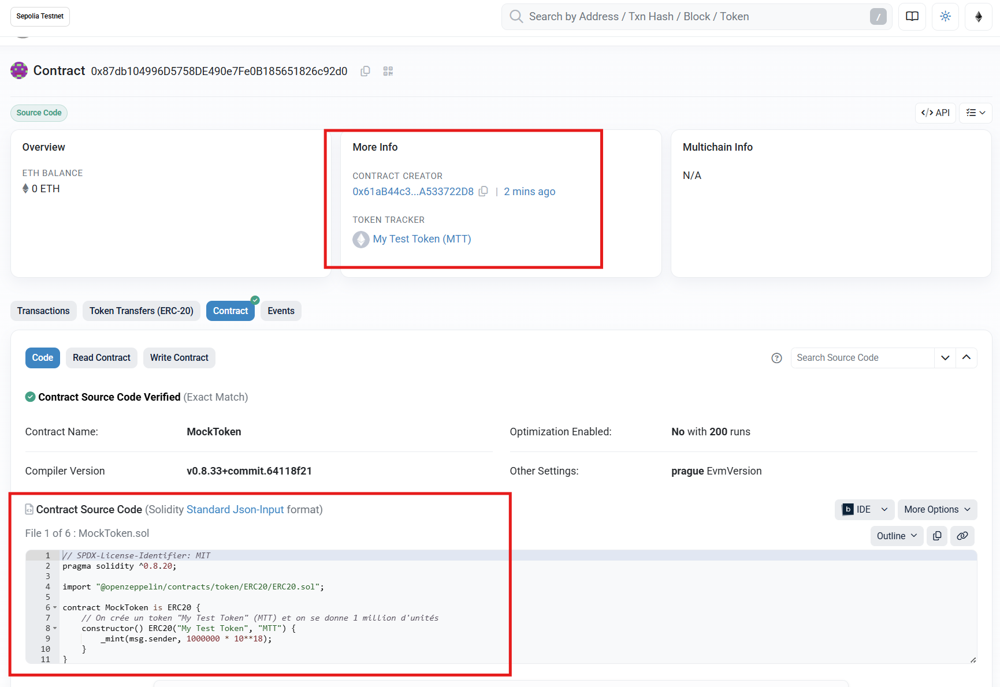

- Le Portefeuille (VestingWallet) : [Voir sur Sepolia Etherscan](https://sepolia.etherscan.io/address/0x2909FdBD478226218ab4039A5758398e50E98bA4#code)
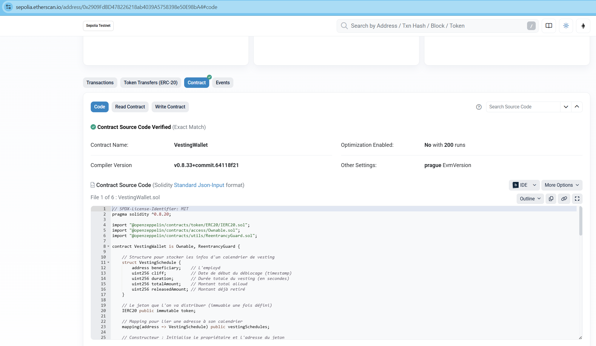

### Phase 4 : Securité : 

Il reste le pilier le plus important de la blockchain : La Sécurité.

Comme indiqué dans le de cours, "une seule ligne de code vulnérable peut entraîner la perte de millions d'euros".

Nous allons passer à l'exercice "Auditez la UnsafeBank" décrit dans le document Les Failles de Sécurité en Solidity.

### Étape 1 : Création du fichier vulnérable
Créez un nouveau fichier src/UnsafeBank.sol. Copiez-y le code ci-dessous. C'est une banque volontairement mal codée qui contient 4 failles critiques.

```js
// SPDX-License-Identifier: MIT
pragma solidity ^0.8.20;

import "@openzeppelin/contracts/access/Ownable.sol";

/**
 * @title UnsafeBank
 * @dev CETTE BANQUE EST VOLONTAIREMENT VULNERABLE. NE PAS UTILISER EN PRODUCTION.
 * Les utilisateurs peuvent déposer et retirer de l'Ether. Le propriétaire peut changer les frais.
 */
contract UnsafeBank is Ownable {
    mapping(address => uint256) public balances;
    address public loggerAddress;
    uint256 public withdrawalFee = 1; // Frais en pourcentage

    constructor() Ownable(msg.sender) {}

    // Dépose de l'Ether dans la banque
    function deposit() external payable {
        // On utilise unchecked pour "optimiser" le gaz... une mauvaise idée ici.
        unchecked {
            balances[msg.sender] += msg.value;
        }
    }

    // Retire l'intégralité du solde de l'utilisateur
    function withdraw() external {
        uint256 userBalance = balances[msg.sender];
        require(userBalance > 0, "Solde insuffisant");

        // Calcule le montant après les frais
        uint256 amountToWithdraw = userBalance - (userBalance * withdrawalFee / 100);

        // Envoie l'Ether AVANT de mettre à jour le solde (TRES DANGEREUX)
        (bool sent, ) = msg.sender.call{value: amountToWithdraw}("");
        require(sent, "Echec de l'envoi d'Ether");

        // Met à jour le solde après l'envoi
        balances[msg.sender] = 0;
    }

    // Fonction réservée au propriétaire pour changer les frais de retrait
    function setWithdrawalFee(uint256 _newFee) external {
        // Authentification dangereuse
        require(tx.origin == owner(), "Seul le proprietaire peut changer les frais");
        require(_newFee <= 5, "Les frais ne peuvent pas depasser 5%");
        withdrawalFee = _newFee;
    }

    // Met à jour l'adresse d'un contrat de logging
    function setLogger(address _newLogger) external onlyOwner {
        loggerAddress = _newLogger;
        // Notifie le nouveau logger, mais sans vérifier si l'appel a réussi
        loggerAddress.call(abi.encodeWithSignature("log(string)", "Adresse du logger mise a jour"));
    }
}
```

### Identification des failles

---

## 1. Réentrance (The DAO Hack)

**Emplacement :** Ligne 35 — fonction `withdraw`

```solidity
(bool sent, ) = msg.sender.call{value: amountToWithdraw}("");
// ...
balances[msg.sender] = 0; // Trop tard !
```

**Problème :**
Le contrat envoie les fonds **avant** d'actualiser le solde de l'utilisateur. Un attaquant peut créer un contrat qui rappelle `withdraw` lors de la réception d'éther, vidant le contrat avant que `balances[msg.sender] = 0` soit exécuté.

**Solution :**
Appliquer le modèle **Checks–Effects–Interactions** : vérifier, mettre à jour l'état, puis effectuer les interactions externes. Exemple :

```solidity
// Checks
uint256 amountToWithdraw = balances[msg.sender];
require(amountToWithdraw > 0, "Nothing to withdraw");

// Effects
balances[msg.sender] = 0;

// Interactions
(bool sent, ) = msg.sender.call{value: amountToWithdraw}("");
require(sent, "Transfer failed");
```

---

## 2. Authentification via `tx.origin` (Phishing)

**Emplacement :** Ligne 45 — fonction `setWithdrawalFee`

```solidity
require(tx.origin == owner(), "Seul le proprietaire peut changer les frais");
```

**Problème :**
`tx.origin` est l'adresse à l'origine de la transaction (l'utilisateur final), tandis que `msg.sender` est l'appelant direct. Un contrat malveillant peut tromper le propriétaire pour qu'il initie une transaction, puis appeler `setWithdrawalFee` : la vérification avec `tx.origin` serait contournée.

**Solution :**
Ne JAMAIS utiliser `tx.origin` pour l'authentification. Utiliser toujours `msg.sender` ou un mécanisme d'accès (`onlyOwner`) :

```solidity
require(msg.sender == owner(), "Seul le proprietaire peut changer les frais");
```

---

## 3. Appels externes non vérifiés (Silent Fail)

**Emplacement :** Ligne 54 — fonction `setLogger`

```solidity
loggerAddress.call(abi.encodeWithSignature("log(string)", "..."));
```

**Problème :**
L'appel `.call` est effectué sans vérifier le booléen de succès. Si le contrat cible échoue ou n'existe pas, la transaction continue sans erreur, masquant des échecs potentiellement critiques.

**Solution :**
Toujours récupérer et vérifier le résultat :

```solidity
(bool success, ) = loggerAddress.call(
    abi.encodeWithSignature("log(string)", "...")
);
require(success, "Log failed");
```

---

## 4. Overflow / Underflow (forcé via `unchecked`)

**Emplacement :** Ligne 21 — fonction `deposit`

```solidity
unchecked {
    balances[msg.sender] += msg.value;
}
```

**Problème :**
Depuis Solidity 0.8.0, les opérations arithmétiques sont protégées par défaut. Le bloc `unchecked` désactive ces vérifications pour économiser du gaz, exposant le contrat à des `overflow`/`underflow` si des montants malicieux sont fournis.

**Solution :**
Supprimer le `unchecked` et conserver les protections par défaut. Si une optimisation est nécessaire, documenter soigneusement la justification et limiter l'usage à des opérations sûres.

```solidity
balances[msg.sender] += msg.value; // protections par défaut actives
```

---

### Remarques 

* Prioriser la sécurité sur de petites économies de gaz.
* Appliquer des patterns reconnus (Checks–Effects–Interactions, `onlyOwner`, `require` sur les retours d'appels externes).
* Considérer l'audit externe et les tests fuzzing pour détecter des cas limites.

### On va proposer un fichier de correction : 

#### Partie 1 : La correction de l'exercice (SafeBank)
Voici comment réécrire le contrat UnsafeBank pour qu'il respecte les critères de sécurité (ReentrancyGuard, Checks-Effects-Interactions, pas de tx.origin).

Créez le fichier `src/SafeBank.sol` :

```js
// SPDX-License-Identifier: MIT
pragma solidity ^0.8.20;

import "@openzeppelin/contracts/access/Ownable.sol";
import "@openzeppelin/contracts/utils/ReentrancyGuard.sol"; // ✅ Import ReentrancyGuard

contract SafeBank is Ownable, ReentrancyGuard {
    mapping(address => uint256) public balances;
    address public loggerAddress;
    uint256 public withdrawalFee = 1;

    constructor() Ownable(msg.sender) {}

    function deposit() external payable {
        // ✅ Protection Overflow/Underflow : On a retiré "unchecked". 
        // Solidity 0.8+ gère cela nativement.
        balances[msg.sender] += msg.value;
    }

    // ✅ ReentrancyGuard : Ajout du modificateur nonReentrant
    function withdraw() external nonReentrant {
        // 1. CHECKS (Vérifications)
        uint256 userBalance = balances[msg.sender];
        require(userBalance > 0, "Solde insuffisant");

        // Calcule le montant après les frais
        uint256 amountToWithdraw = userBalance - (userBalance * withdrawalFee / 100);

        // 2. EFFECTS (Effets) : On met à jour l'état AVANT d'envoyer l'argent
        balances[msg.sender] = 0;

        // 3. INTERACTIONS (Interactions) : On envoie l'Ether à la fin
        (bool sent, ) = msg.sender.call{value: amountToWithdraw}("");
        require(sent, "Echec de l'envoi d'Ether");
    }

    function setWithdrawalFee(uint256 _newFee) external {
        // ✅ Authentification : On remplace tx.origin par msg.sender (via onlyOwner ou check direct)
        require(msg.sender == owner(), "Seul le proprietaire peut changer les frais");
        
        // ✅ Validation des entrées
        require(_newFee <= 5, "Les frais ne peuvent pas depasser 5%");
        withdrawalFee = _newFee;
    }

    function setLogger(address _newLogger) external onlyOwner {
        // ✅ Validation des entrées : On vérifie que l'adresse n'est pas nulle
        require(_newLogger != address(0), "Logger address cannot be zero");
        loggerAddress = _newLogger;
        
        // ✅ Appels externes vérifiés : On vérifie le retour de .call
        (bool success, ) = loggerAddress.call(abi.encodeWithSignature("log(string)", "Adresse du logger mise a jour"));
        require(success, "Log failed");
    }
}
```

#### Partie 2 : Sécurisation de la DApp Principale (VestingWallet)
Maintenant, appliquons votre checklist à votre projet principal. Le point crucial ici est l'ajout de SafeERC20.

Pourquoi SafeERC20 ? L'interface standard IERC20 dit que transfer doit retourner un bool. Cependant, certains tokens très connus (comme l'USDT sur Ethereum) ne retournent rien (pas de booléen). Si on utilise IERC20(token).transfer(), le contrat va "revert" (échouer) avec l'USDT car il attend une valeur de retour qu'il ne reçoit pas. SafeERC20 gère ces cas bizarres pour nous.

Mettre a jour `src/VestingWallet.sol`:

```js
// SPDX-License-Identifier: MIT
pragma solidity ^0.8.20;

import "@openzeppelin/contracts/token/ERC20/IERC20.sol";
import "@openzeppelin/contracts/token/ERC20/utils/SafeERC20.sol"; // ✅ Import SafeERC20
import "@openzeppelin/contracts/access/Ownable.sol";
import "@openzeppelin/contracts/utils/ReentrancyGuard.sol";

contract VestingWallet is Ownable, ReentrancyGuard {
    // ✅ Utilisation de la librairie pour sécuriser tous les appels ERC20
    using SafeERC20 for IERC20; 

    struct VestingSchedule {
        address beneficiary;
        uint256 cliff;
        uint256 duration;
        uint256 totalAmount;
        uint256 releasedAmount;
    }

    IERC20 public immutable token;
    mapping(address => VestingSchedule) public vestingSchedules;

    constructor(address tokenAddress) Ownable(msg.sender) {
        // ✅ Validation des entrées
        require(tokenAddress != address(0), "Token address cannot be zero");
        token = IERC20(tokenAddress);
    }

    function createVestingSchedule(
        address _beneficiary,
        uint256 _totalAmount,
        uint256 _cliff,
        uint256 _duration
    ) external onlyOwner {
        // ✅ Validation complète des entrées
        require(_beneficiary != address(0), "Beneficiary cannot be zero address");
        require(_totalAmount > 0, "Amount must be > 0");
        require(_duration > 0, "Duration must be > 0");
        require(_cliff >= block.timestamp, "Cliff must be in the future"); // Optionnel, selon logique métier
        require(vestingSchedules[_beneficiary].totalAmount == 0, "Schedule already exists");

        // ✅ Checks-Effects-Interactions + SafeERC20
        // On effectue le transfert (Interaction) avant l'enregistrement (Effect) ICI c'est une exception courante
        // car on veut être sûr d'avoir les fonds avant de valider le calendrier. 
        // Cependant, grâce à ReentrancyGuard sur les fonctions de retrait, c'est sécurisé.
        
        // Utilisation de safeTransferFrom au lieu de transferFrom
        token.safeTransferFrom(msg.sender, address(this), _totalAmount);

        vestingSchedules[_beneficiary] = VestingSchedule({
            beneficiary: _beneficiary,
            cliff: _cliff,
            duration: _duration,
            totalAmount: _totalAmount,
            releasedAmount: 0
        });
    }

    function getVestedAmount(address _beneficiary) public view returns (uint256) {
        VestingSchedule memory schedule = vestingSchedules[_beneficiary];

        if (schedule.totalAmount == 0) return 0;
        if (block.timestamp < schedule.cliff) return 0;
        if (block.timestamp >= schedule.cliff + schedule.duration) return schedule.totalAmount; // ✅ Overflow protection native 0.8+

        uint256 timeSinceCliff = block.timestamp - schedule.cliff;
        return (schedule.totalAmount * timeSinceCliff) / schedule.duration;
    }

    function claimVestedTokens() external nonReentrant { // ✅ ReentrancyGuard
        VestingSchedule storage schedule = vestingSchedules[msg.sender];
        require(schedule.totalAmount > 0, "No vesting schedule found");

        uint256 vestedAmount = getVestedAmount(msg.sender);
        uint256 claimable = vestedAmount - schedule.releasedAmount;
        require(claimable > 0, "Nothing to claim yet");

        // ✅ Checks-Effects-Interactions
        // Effect : Mise à jour de l'état AVANT le transfert
        schedule.releasedAmount += claimable;

        // Interaction : Transfert sécurisé avec SafeERC20
        token.safeTransfer(msg.sender, claimable);
    }
}
```

### On rebuild : 

```bash
enkao@workspace MINGW64 ~/Desktop/blockchain/my-counter-project (master)
$ forge test
[⠊] Compiling...
[⠘] Compiling 4 files with Solc 0.8.33
[⠃] Solc 0.8.33 finished in 628.48ms
Compiler run successful with warnings:
[...]
```

## On lance les tests : 


```bash
enkao@workspace MINGW64 ~/Desktop/blockchain/my-counter-project (master)
$ forge test
[⠊] Compiling...
No files changed, compilation skipped

Ran 1 test for test/VestingWallet.t.sol:VestingWalletTest
[PASS] test_FullVestingScenario() (gas: 213395)
Suite result: ok. 1 passed; 0 failed; 0 skipped; finished in 457.60µs (130.20µs CPU time)

Ran 2 tests for test/Counter.t.sol:CounterTest
[PASS] testFuzz_SetNumber(uint256) (runs: 256, μ: 29133, ~: 29289)
[PASS] test_Increment() (gas: 28783)
Suite result: ok. 2 passed; 0 failed; 0 skipped; finished in 3.52ms (3.32ms CPU time)

Ran 2 test suites in 9.76ms (3.98ms CPU time): 3 tests passed, 0 failed, 0 skipped (3 total tests)
```

### 🛡️ Vesting Wallet DApp & Security Audit

#### 1. VestingWallet (Smart Contract)
Un système permettant de bloquer des jetons ERC20 pour un bénéficiaire et de les libérer linéairement dans le temps.
- **Sécurité :** Utilisation de `SafeERC20`, `ReentrancyGuard`, et Pattern Checks-Effects-Interactions.
- **Fonctionnalités :** Création de calendrier, Cliff (période de blocage), Calcul proportionnel des gains.

#### 2. SafeBank (Audit & Fix)
Correction d'un contrat bancaire volontairement vulnérable (`UnsafeBank`).
- **Failles corrigées :** Reentrancy, tx.origin phishing, Unchecked external calls, Overflow (via solidity 0.8+).

#### 🛠️ Stack Technique

- **Langage :** Solidity ^0.8.20
- **Framework :** Foundry (Forge, Cast, Anvil)
- **Standards :** OpenZeppelin (ERC20, Ownable, SafeERC20)

✅ Sécurité implémentée
[x] SafeERC20 pour gérer les tokens non-standards (USDT).
[x] ReentrancyGuard pour empêcher les attaques de réentrance.
[x] Checks-Effects-Interactions pour l'ordre des opérations.
[x] Validation des entrées (Address 0, Montants > 0).

### Autres problemes 
J'ai rencontré un probleme lors d'un push sur github dans un job. 
J'ai lancer : `forge fmt` pour formater le code, j'ai lancer `forge test` pour restester si tout va bien, puis, j'ai repush et ça a fonctionner. 